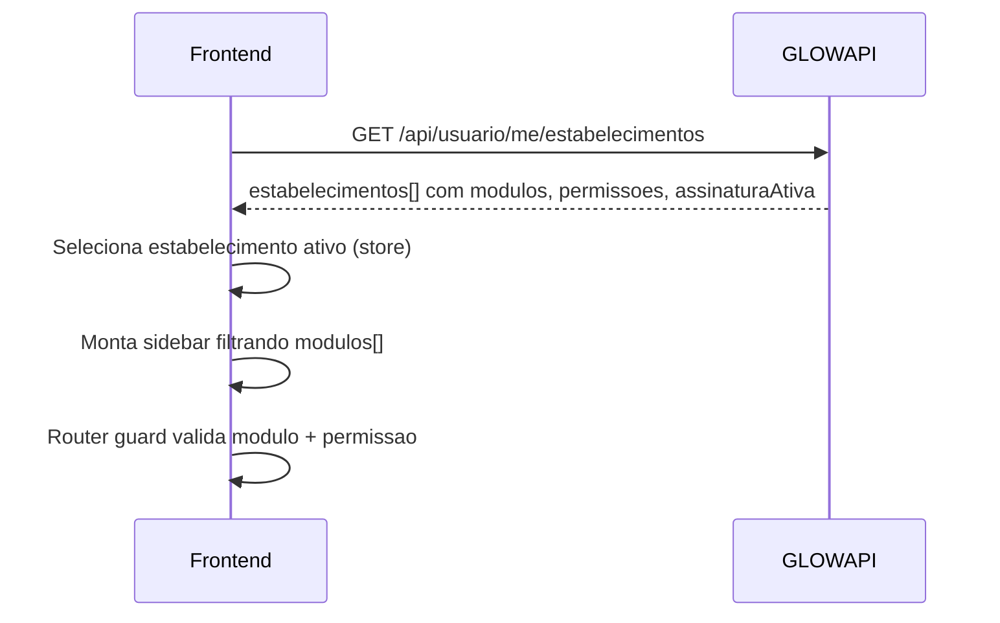

# Spec — Liberacao de modulos (frontend)

## Objetivo

Definir como o app decide **o que mostrar** no menu, nas rotas e nos botoes de acao apos o tenant contratar um plano.

---

## Estados da assinatura

| `status` (API) | `assinaturaAtiva` | Modulos operacionais | UX no app |
|----------------|:-----------------:|:--------------------:|-----------|
| `Trial` | `true` | Liberados | Banner "Periodo de teste" + data fim |
| `Ativa` | `true` | Liberados | Operacao normal |
| `PendentePagamento` | `false` | Bloqueados | Tela "Conclua o pagamento" |
| `Cancelada` | `false` | Bloqueados | Tela "Reative sua assinatura" |
| `Suspensa` | `false` | Bloqueados | Tela "Assinatura suspensa" |
| `Expirada` | `false` | Bloqueados | Tela "Assinatura expirada" |

> `assinaturaAtiva` vem de `GET /api/usuario/me/estabelecimentos`. A API considera **Ativa** e **Trial** como ativas.

---

## Fluxo pos-login (negocio)



---

## Composicao de `modulos[]`

Sempre inclui base quando assinatura ativa:

```text
Estabelecimento, Assinatura + modulos do plano contratado
```

Exemplo Basic ativo:

```json
["Estabelecimento", "Assinatura", "Agenda", "Servicos", "HorariosAtendimento", "Notificacoes", "Email"]
```

---

## Camadas no frontend

```text
1. Role global (Cliente vs negocio)     -> layout / menu base
2. assinaturaAtiva                      -> bloqueio geral do painel operacional
3. modulos[]                            -> item de menu e rota
4. permissoes[]                         -> botao / acao dentro da tela
```

**Nao** inferir modulos apenas pelo nome do plano no cliente. Usar sempre o array retornado pela API apos login.

---

## Pre-contratacao (sem assinatura)

Antes de `POST /api/assinaturas`:

- Usar `GET /api/planos` para vitrine e comparacao (`modulos`, `funcionalidades`, limites).
- Usuario pode estar autenticado mas **sem** `assinaturaAtiva` — redirecionar para onboarding.

---

## Troca de plano

1. Usuario em plano ativo solicita upgrade (`POST /api/assinaturas/{id}/trocar-plano`).
2. Se houver cobranca pendente de troca: manter modulos do plano **atual** ate webhook confirmar.
3. Apos confirmacao: refetch `GET /api/usuario/me/estabelecimentos` para atualizar `modulos[]`.

---

## Erros HTTP

| Code | Acao no app |
|------|-------------|
| `SUBSCRIPTION_MODULE_BLOCKED` | Modal upgrade — plano minimo na spec do modulo |
| `INVALID_SUBSCRIPTION_SCOPE` | Estabelecimento nao selecionado na store |
| 403 generico (permissao) | Toast "Sem permissao para esta acao" |

Adicionar em `apiErrors.ts`:

```ts
SUBSCRIPTION_MODULE_BLOCKED: 'Recurso nao disponivel no seu plano. Faca upgrade para continuar.',
INVALID_SUBSCRIPTION_SCOPE: 'Selecione um estabelecimento para continuar.',
```

---

## Criterios de aceite

- [ ] Sidebar nao exibe "Financeiro" no Basic/Plus.
- [ ] Com `PendentePagamento`, agenda retorna 403 e app mostra paywall.
- [ ] Com `Trial`, agenda funciona e banner de trial visivel.
- [ ] Apos webhook (simulado em staging), refetch libera modulos sem relogin.
