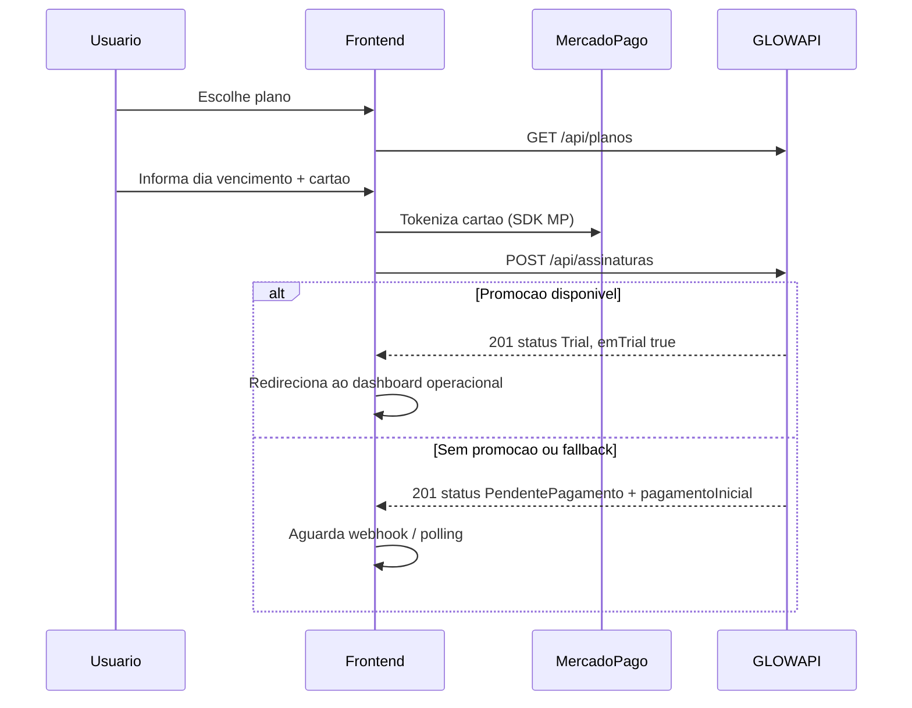

# Spec — Onboarding de assinatura (frontend)

Fluxo para **DonoEstabelecimento** ou **ProfissionalAutonomo** contratar plano e liberar modulos operacionais.

Convencoes: [../../frontend/convencoes.md](../../frontend/convencoes.md)

---

## Visao geral



---

## Pre-requisitos

- Conta ativa (e-mail confirmado).
- Role global `DonoEstabelecimento` ou `ProfissionalAutonomo`.
- SDK Mercado Pago configurado no frontend (chave publica do ambiente).

---

## Passo 1 — Vitrine de planos

Rota: `/onboarding/planos`

- `GET /api/planos` — **sem auth**.
- Exibir cards Basic / Plus / Premium com `preco`, `funcionalidades`, `modulos`.
- Badge de promocao quando `promocaoLancamento.disponivel === true`.
- CTA "Comecar" → checkout com `planoId` selecionado.

Detalhes: [catalogo-planos.md](./catalogo-planos.md), [promocao-lancamento.md](./promocao-lancamento.md).

---

## Passo 2 — Checkout

Rota: `/onboarding/checkout?planoId=1`

### Campos do formulario

| Campo | Obrigatorio | Origem |
|-------|:-----------:|--------|
| Plano | sim | query ou store |
| Dia de vencimento | sim | `promocaoLancamento.diasVencimentoPermitidos` ou fixo `[5,10,15,20]` |
| Dados do negocio | sim* | formulario onboarding |
| Cartao (token MP) | sim | SDK transparente |

\* Para estabelecimento novo: body `estabelecimento`. Para autonomo: `profissionalAutonomo`. Para negocio existente: `estabelecimentoId`.

### Request

`POST /api/assinaturas`

**Headers:** `Content-Type: application/json`, `x-glow-token`

**Payload completo (todos os cenarios):** [payload-assinatura.md](./payload-assinatura.md)

Resumo dos blocos:

| Cenario | Campos de identidade |
|---------|----------------------|
| Dono + negocio novo | `estabelecimento` { nome, descricao, **logo**, telefone, email, endereco } |
| Dono + negocio existente | `estabelecimentoId` |
| Autonomo novo | `profissionalAutonomo` { nomePublico, biografia, **logo**, telefone, email, endereco } |
| Autonomo existente | `profissionalAutonomoId` |

### Logo (base64 — igual avatar)

- Campo unico: `logo` (string), **nao** `logoBase64`.
- Formato: data URI `data:image/png;base64,...` (preferido).
- Regras: JPEG/PNG/WebP, max 5 MB — reutilizar `validateAvatarFile` e `readFileAsDataUrl` de `src/utils/avatarFile.ts`.
- Componente sugerido: `LogoUploader` (mesmo UX do `ProfileAvatarEditor`).

> **Backend:** coluna `Logo` hoje limita 500 caracteres. Base64 real exige migracao para `text` (como `Usuario.AvatarBase64`). Validar com API antes de habilitar upload no checkout.

### Exemplo minimo — estabelecimento novo

Ver payload integral em [payload-assinatura.md#payload-1--estabelecimento-novo-completo](./payload-assinatura.md).

---

## Passo 3 — Resposta

**201** envelope:

```json
{
  "success": true,
  "message": "Assinatura iniciada com sucesso.",
  "data": {
    "id": 42,
    "planoId": 1,
    "estabelecimentoId": 12,
    "status": "Trial",
    "gateway": "MercadoPago",
    "inicio": "2026-06-07T00:00:00Z",
    "fim": null,
    "diaVencimento": 10,
    "proximaDataVencimento": "2026-07-10T00:00:00Z",
    "proximaDataGeracaoCobranca": "2026-07-08T00:00:00Z",
    "proximaDataAlerta": "2026-07-07T00:00:00Z",
    "emTrial": true,
    "diasTrial": 30,
    "pagamentoInicial": null
  }
}
```

### Ramo trial (`emTrial: true`)

- Modulos **ja liberados**.
- Redirecionar para `/dashboard` com toast de boas-vindas.
- Exibir banner com dias restantes (`diasTrial`, `proximaDataVencimento`).

### Ramo pago imediato (`status: PendentePagamento`)

- `pagamentoInicial` pode trazer `checkoutUrl` / `qrCode` se gateway exigir.
- Tela de aguardo: "Processando pagamento...".
- Poll `GET /api/usuario/me/estabelecimentos` ate `assinaturaAtiva === true` ou timeout.

---

## Passo 4 — Pos-ativacao

1. `GET /api/usuario/me/estabelecimentos` — popular `negocio.store`.
2. Montar sidebar com `modulos[]`.
3. Opcional: tour guiado pelos modulos liberados.

---

## Trocar plano (upgrade)

Rota: `/configuracoes/assinatura/upgrade`

`POST /api/assinaturas/{assinaturaId}/trocar-plano`

```json
{
  "novoPlanoId": 2,
  "gateway": "MercadoPago",
  "pagamento": { "token": "...", "paymentMethodId": "visa" }
}
```

- Upgrade com cobranca: manter UI do plano atual ate confirmacao.
- Downgrade: confirmar perda de modulos (modal de alerta).

---

## Cancelar

`POST /api/assinaturas/{assinaturaId}/cancelar`

- Modal de confirmacao com data de fim de acesso.
- Apos cancelamento: `assinaturaAtiva = false` → paywall.

---

## Telas e componentes sugeridos

| Componente | Responsabilidade |
|------------|------------------|
| `PlanoCard` | Card da vitrine com modulos e preco |
| `PromocaoBanner` | Vagas restantes + trial 30 dias |
| `DiaVencimentoSelect` | Select 5/10/15/20 |
| `MercadoPagoCardForm` | Tokenizacao do cartao |
| `AssinaturaStatusBadge` | Trial / Ativa / Pendente |
| `OnboardingWizard` | Steps: plano → negocio → pagamento |

---

## Erros comuns

| Code / HTTP | UX |
|-------------|-----|
| 400 validacao | Destacar campo (ex.: `diaVencimento` invalido) |
| 409 assinatura existente | "Voce ja possui assinatura ativa" |
| Falha token MP | "Nao foi possivel validar o cartao" |

---

## Criterios de aceite

- [ ] Vitrine funciona sem login.
- [ ] Checkout exige auth e e-mail confirmado.
- [ ] Trial libera dashboard sem tela de pagamento pendente.
- [ ] Fallback pago exibe estado de aguardo.
- [ ] Refetch de estabelecimentos apos 201 atualiza menu.
