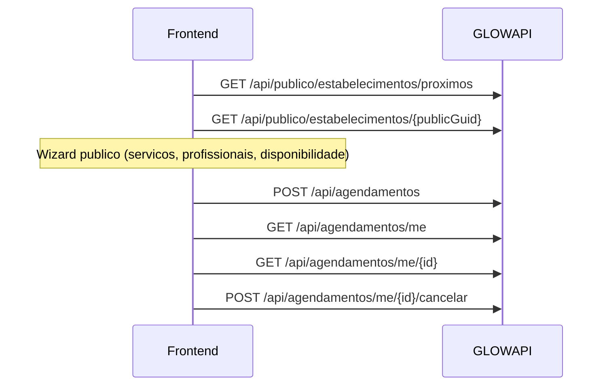

# Area do cliente — agendamento

Fluxo logado para descobrir lojas, agendar, acompanhar e gerenciar agendamentos.

**Auth:** header `x-glow-token` em todas as rotas privadas (ver [convencoes.md](./convencoes.md)).

---

## Fluxo de telas



| Tela | Rota frontend | Documento |
|------|---------------|-----------|
| Explorar lojas | `/explorar` | [descoberta-estabelecimentos.md](./descoberta-estabelecimentos.md) |
| Detalhe da loja | `/loja/{publicGuid}` | Este documento |
| Wizard de agendamento | `/loja/{publicGuid}/agendar?profissional={guid}` | [agendamento-publico-profissional.md](./acesso/agendamento-publico-profissional.md) |
| Responder reagendamento | `/agendamento/remarcacao/{token}` | Mesmo documento |
| Meus agendamentos | `/meus-agendamentos` | Este documento |

---

## Detalhe publico da loja

`GET /api/publico/estabelecimentos/{publicGuid}`

Query opcional: `latitude`, `longitude` (calcula `distanciaKm` quando o endereco da loja tem coordenadas).

**Resposta (`data`):**

```json
{
  "publicGuid": "uuid",
  "nome": "Barbearia Glow",
  "logo": "https://...",
  "descricao": "Descricao curta...",
  "endereco": {
    "logradouro": "Rua A",
    "bairro": "Centro",
    "cidade": "Sao Paulo",
    "estado": "SP"
  },
  "distanciaKm": 2.5
}
```

---

## Wizard publico (sem auth)

Reutilize as rotas existentes em `/api/publico/agendar`:

| Etapa | Metodo | Rota |
|-------|--------|------|
| Servicos | GET | `/api/publico/agendar/loja/{publicGuid}/servicos` |
| Profissionais | GET | `/api/publico/agendar/loja/{publicGuid}/profissionais` |
| Disponibilidade | GET | `/api/publico/agendar/loja/{publicGuid}/disponibilidade?data=...&servicoIds=...` |
| Criar (visitante) | POST | `/api/publico/agendar/loja/{publicGuid}` |

Para cliente **logado**, use `POST /api/agendamentos` (nao envie dados de visitante — a API usa o perfil da sessao).

---

## Criar agendamento logado

`POST /api/agendamentos`

**Headers:** `x-glow-token`, `Content-Type: application/json`

**Body:**

```json
{
  "estabelecimentoPublicGuid": "uuid-da-loja",
  "profissionalPublicGuid": "uuid-do-profissional",
  "servicoIds": [1],
  "data": "2026-06-08",
  "horarioInicio": "10:00:00",
  "observacao": "Opcional"
}
```

**201 — `data` (AgendamentoClienteResponseDto):**

```json
{
  "id": 42,
  "status": "PendenteConfirmacao",
  "valorTotal": 55.00,
  "duracaoTotalMinutos": 60,
  "inicio": "2026-06-08T13:00:00Z",
  "fim": "2026-06-08T14:00:00Z",
  "estabelecimentoPublicGuid": "uuid",
  "estabelecimentoNome": "Barbearia Glow",
  "estabelecimentoLogo": "",
  "endereco": {
    "logradouro": "Rua A",
    "bairro": "Centro",
    "cidade": "Sao Paulo",
    "estado": "SP"
  },
  "observacao": "",
  "origem": "Logado",
  "createAd": "2026-05-30T12:00:00Z",
  "canceladoEm": null,
  "itens": [
    {
      "id": 1,
      "servicoId": 1,
      "servicoNome": "Corte",
      "profissionalId": 2,
      "profissionalNome": "Joao",
      "inicio": "2026-06-08T13:00:00Z",
      "fim": "2026-06-08T14:00:00Z",
      "valor": 55.00,
      "status": "Pendente"
    }
  ]
}
```

---

## Listar meus agendamentos

`GET /api/agendamentos/me`

**Query params:**

| Param | Tipo | Padrao | Descricao |
|-------|------|--------|-----------|
| `status` | string | — | Ex.: `Confirmado`, `Cancelado` |
| `dataInicio` | DateTime | — | Filtra pelo horario de inicio |
| `dataFim` | DateTime | — | Filtra pelo horario de inicio |
| `estabelecimentoPublicGuid` | Guid | — | Filtra por loja |
| `pagina` | int | 1 | Pagina |
| `tamanhoPagina` | int | 20 | Max 50 |
| `ordenacao` | string | `proximos` | `proximos` ou `recentes` |

**200 — `data`:**

```json
{
  "total": 3,
  "pagina": 1,
  "tamanhoPagina": 20,
  "itens": [ "...AgendamentoClienteResponseDto..." ]
}
```

---

## Detalhe do agendamento

`GET /api/agendamentos/me/{id}`

Retorna o mesmo formato de `AgendamentoClienteResponseDto`. **404** se o agendamento nao pertencer ao usuario logado (`AGENDAMENTO_NAO_ENCONTRADO`).

---

## Cancelar agendamento

`POST /api/agendamentos/me/{id}/cancelar`

**Body:**

```json
{
  "motivo": "Nao poderei comparecer"
}
```

**Regras:** motivo obrigatorio; status deve permitir cancelamento (pendente, confirmado, remarcado, em atendimento).

---

## Remarcar agendamento

`POST /api/agendamentos/me/{id}/remarcar`

**Body:**

```json
{
  "data": "2026-06-09",
  "horarioInicio": "14:00:00",
  "motivo": "Conflito de horario"
}
```

**Regras:** motivo obrigatorio; nova data/hora deve estar disponivel; status pendente, confirmado ou remarcado.

---

## Erros comuns

| HTTP | code | Quando |
|------|------|--------|
| 401 | `UNAUTHORIZED` | Sem token ou sessao invalida |
| 404 | `AGENDAMENTO_NAO_ENCONTRADO` | ID inexistente ou de outro cliente |
| 400 | `AGENDAMENTO_STATUS_INVALIDO` | Acao invalida para o status atual |
| 409 | `HORARIO_INDISPONIVEL` | Conflito ao criar/remarcar |

---

## Checklist frontend

- [ ] Explorar → detalhe da loja → wizard → criar com token
- [ ] Listagem com filtros (`proximos` vs `recentes`)
- [ ] Tela de detalhe com cancelar/remarcar
- [ ] Tratar erros por `code` (ver [convencoes.md](./convencoes.md))
