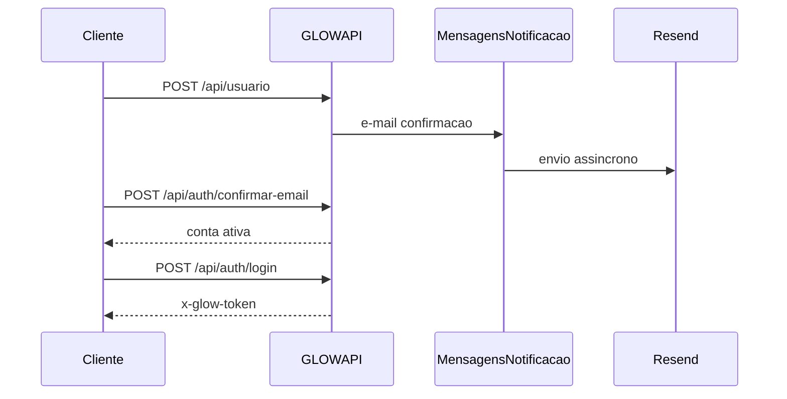

# Cadastro de usuarios (cliente)

Guia rapido para criar conta, confirmar e-mail e fazer login na GLOWAPI.

**Base URL local (padrao):** `http://localhost:5127`  
**Swagger:** `http://localhost:5127/swagger`

Substitua `BASE` abaixo pela URL da sua API (local, staging ou producao).

---

## Visao geral



| Etapa | Endpoint | Autenticacao |
|-------|----------|--------------|
| 1. Cadastro | `POST /api/usuario` | Nao |
| 2. Confirmar e-mail | `POST /api/auth/confirmar-email` | Nao |
| 3. (Opcional) Reenviar | `POST /api/auth/reenviar-confirmacao` | Nao |
| 4. Login | `POST /api/auth/login` | Nao |
| 5. Perfil | `GET /api/usuario/me` | Header `x-glow-token` |

---

## Regras de negocio

- Cadastro publico cria **sempre** usuario com role `Cliente` — **nao** envie `role` no JSON.
- Conta inicia com `ativo: false` ate confirmar o e-mail.
- Confirmacao aceita **link (token)** ou **codigo de 6 digitos** — informe **exatamente um** dos dois no body.
- Senha: minimo 6 caracteres, com maiuscula, minuscula, numero e caractere especial.
- Avatar opcional em **base64** (data URI ou base64 + `avatarContentType`); maximo 5 MB; tipos `image/jpeg`, `image/png`, `image/webp`.
- E-mail de confirmacao e enfileirado na mensageria e enviado via Resend quando `Mensageria:Email:Habilitado=true` e token configurado (ver [Mensageria-assincrona.md](../context/Mensageria-assincrona.md)).

---

## 1. Cadastrar cliente

### `POST /api/usuario`

**Headers:** `Content-Type: application/json`  
**Resposta:** `201 Created` (body direto, sem envelope `success`)

### Body

| Campo | Obrigatorio | Descricao |
|-------|-------------|-----------|
| `nome` | Sim | 3–150 caracteres |
| `email` | Sim | E-mail valido |
| `telefone` | Sim | Ate 20 caracteres |
| `senha` | Sim | Regra de complexidade acima |
| `avatarBase64` | Nao | Data URI ou base64 puro |
| `avatarContentType` | Nao | Obrigatorio se `avatarBase64` for base64 puro (ex.: `image/png`) |

### Exemplo de resposta (201)

```json
{
  "id": 1,
  "nome": "Maria Silva",
  "email": "maria@email.com",
  "telefone": "11999999999",
  "ativo": false,
  "avatarBase64": null,
  "mensagem": "Cadastro realizado. Confirme seu e-mail (link ou codigo) para ativar a conta."
}
```

### cURL — cadastro simples

```bash
BASE=http://localhost:5127

curl -s -X POST "$BASE/api/usuario" \
  -H "Content-Type: application/json" \
  -d '{
    "nome": "Maria Silva",
    "email": "maria@email.com",
    "telefone": "11999999999",
    "senha": "Senha123!"
  }' | jq .
```

### cURL — cadastro com avatar (PNG 1x1 em base64)

```bash
BASE=http://localhost:5127

curl -s -X POST "$BASE/api/usuario" \
  -H "Content-Type: application/json" \
  -d '{
    "nome": "Usuario Avatar",
    "email": "avatar@email.com",
    "telefone": "11988887777",
    "senha": "Senha123!",
    "avatarBase64": "data:image/png;base64,iVBORw0KGgoAAAANSUhEUgAAAAEAAAABCAYAAAAfFcSJAAAADUlEQVR42mP8z8BQDwAEhQGAhKmMIQAAAABJRU5ErkJggg=="
  }' | jq .
```

### PowerShell (Windows)

```powershell
$base = "http://localhost:5127"
$body = @{
  nome     = "Maria Silva"
  email    = "maria@email.com"
  telefone = "11999999999"
  senha    = "Senha123!"
} | ConvertTo-Json

Invoke-RestMethod -Method Post -Uri "$base/api/usuario" -ContentType "application/json" -Body $body
```

---

## 2. Confirmar e-mail

### `POST /api/auth/confirmar-email`

**Resposta:** `200` com envelope:

```json
{
  "success": true,
  "message": "E-mail confirmado com sucesso. Voce ja pode fazer login."
}
```

### Body — por codigo (6 digitos)

```json
{ "codigo": "482913" }
```

### Body — por token (do link no e-mail)

```json
{ "token": "opaque-token-do-link" }
```

O link enviado no e-mail segue o formato:

`{Auth:FrontendBaseUrl}/confirmar-email?token=<token>`

### cURL — confirmar com codigo

```bash
BASE=http://localhost:5127
CODIGO=482913

curl -s -X POST "$BASE/api/auth/confirmar-email" \
  -H "Content-Type: application/json" \
  -d "{\"codigo\": \"$CODIGO\"}" | jq .
```

### cURL — confirmar com token

```bash
BASE=http://localhost:5127
TOKEN="cole-o-token-do-link-ou-do-banco"

curl -s -X POST "$BASE/api/auth/confirmar-email" \
  -H "Content-Type: application/json" \
  -d "{\"token\": \"$TOKEN\"}" | jq .
```

### Obter codigo em desenvolvimento (sem caixa de e-mail)

Com a API e o worker de mensageria rodando, o conteudo fica na fila PostgreSQL:

```sql
SELECT "Conteudo", "Status", "CriadoEm"
FROM "MensagensNotificacao"
WHERE "Canal" = 'Email'
  AND "Destinatario" = 'maria@email.com'
ORDER BY "CriadoEm" DESC
LIMIT 1;
```

No campo `Conteudo`, procure a linha `Ou digite o codigo no app: XXXXXX` ou o parametro `token=` no link.

---

## 3. Reenviar confirmacao

### `POST /api/auth/reenviar-confirmacao`

Sempre retorna mensagem generica (nao revela se o e-mail existe).

```bash
BASE=http://localhost:5127

curl -s -X POST "$BASE/api/auth/reenviar-confirmacao" \
  -H "Content-Type: application/json" \
  -d '{"email": "maria@email.com"}' | jq .
```

```json
{
  "success": true,
  "message": "Se o e-mail estiver cadastrado e pendente de confirmacao, enviaremos um novo link e codigo."
}
```

---

## 4. Login (apos confirmacao)

### `POST /api/auth/login`

```bash
BASE=http://localhost:5127

curl -s -X POST "$BASE/api/auth/login" \
  -H "Content-Type: application/json" \
  -d '{
    "email": "maria@email.com",
    "senha": "Senha123!"
  }' | jq .
```

Salve o `data.token` e use nas rotas protegidas:

```bash
TOKEN="eyJ1aWQi..."

curl -s "$BASE/api/usuario/me" \
  -H "x-glow-token: $TOKEN" | jq .
```

---

## Fluxo completo em um script (bash)

```bash
#!/usr/bin/env bash
set -euo pipefail

BASE="${BASE:-http://localhost:5127}"
EMAIL="${EMAIL:-teste.curl@$(date +%s).local}"
SENHA="${SENHA:-Senha123!}"
NOME="${NOME:-Teste Curl}"

echo "==> Health"
curl -sf "$BASE/health" | jq .

echo "==> Cadastro ($EMAIL)"
curl -sf -X POST "$BASE/api/usuario" \
  -H "Content-Type: application/json" \
  -d "{\"nome\":\"$NOME\",\"email\":\"$EMAIL\",\"telefone\":\"11999999999\",\"senha\":\"$SENHA\"}" | jq .

echo "==> Login sem confirmar (esperado 403)"
curl -s -o /tmp/login.json -w "%{http_code}" -X POST "$BASE/api/auth/login" \
  -H "Content-Type: application/json" \
  -d "{\"email\":\"$EMAIL\",\"senha\":\"$SENHA\"}"
echo
cat /tmp/login.json | jq .

echo ""
echo "Confirme o e-mail com codigo ou token, depois:"
echo "  curl -s -X POST \"$BASE/api/auth/confirmar-email\" -H \"Content-Type: application/json\" -d '{\"codigo\":\"SEU_CODIGO\"}'"
echo "  curl -s -X POST \"$BASE/api/auth/login\" -H \"Content-Type: application/json\" -d '{\"email\":\"$EMAIL\",\"senha\":\"$SENHA\"}'"
```

---

## Codigos de erro comuns

Resposta de erro padrao:

```json
{
  "success": false,
  "message": "Descricao legivel",
  "code": "CODIGO_ERRO"
}
```

| HTTP | `code` | Quando |
|------|--------|--------|
| 409 | `EMAIL_JA_CADASTRADO` | E-mail ja existe no cadastro |
| 400 | `CONFIRMACAO_EMAIL_INVALIDA` | Token/codigo invalido, expirado ou enviou ambos/nenhum |
| 403 | `EMAIL_NAO_CONFIRMADO` | Login antes de confirmar e-mail |
| 401 | `INVALID_CREDENTIALS` | E-mail ou senha incorretos no login |
| 400 | `AVATAR_INVALIDO` | Avatar base64 invalido ou fora do limite |

Cadastro com validacao de modelo (campo ausente): `400` com mensagens de validacao ASP.NET.

---

## Rotas relacionadas (autenticadas)

| Metodo | Rota | Descricao |
|--------|------|-----------|
| GET | `/api/usuario/me` | Perfil do usuario logado |
| PUT | `/api/usuario/me` | Atualizar perfil |
| DELETE | `/api/usuario/me` | Desativar conta |
| POST | `/api/auth/logout` | Encerrar sessao |
| POST | `/api/auth/refresh` | Renovar tokens |

Header de autenticacao (configuravel; padrao): `x-glow-token: <token>`.

---

## Pre-requisitos para testar localmente

```bash
# Terminal 1 — API (workers de mensageria inclusos)
dotnet run --project src/GLOWAPI.API

# Terminal 2 — migrations (se necessario)
dotnet ef database update --project src/GLOWAPI.Infrastructure --startup-project src/GLOWAPI.API
```

Para receber e-mail de verdade em dev, configure User Secrets:

```bash
dotnet user-secrets set "RESEND_APITOKEN" "re_..." --project src/GLOWAPI.API
dotnet user-secrets set "Mensageria:Email:From" "Glow Up Connect <noreply@seu-dominio.com>" --project src/GLOWAPI.API
dotnet user-secrets set "Mensageria:Email:Habilitado" "true" --project src/GLOWAPI.API
dotnet user-secrets set "Auth:FrontendBaseUrl" "http://localhost:3000" --project src/GLOWAPI.API
```

Sem Resend habilitado, use a consulta SQL na secao 2 para obter o codigo da fila.

---

## Referencias no codigo

| Artefato | Caminho |
|----------|---------|
| Controller cadastro | `src/GLOWAPI.API/Controllers/UsuarioController.cs` |
| Controller auth | `src/GLOWAPI.API/Controllers/AuthController.cs` |
| DTO cadastro | `src/GLOWAPI.Application/DTOs/Usuario/CadastrarClienteDto.cs` |
| Servico confirmacao | `src/GLOWAPI.Application/Services/ConfirmacaoEmailService.cs` |
| Testes de integracao | `tests/GLOWAPI.Tests/Integration/AuthControllerTests.cs` |
