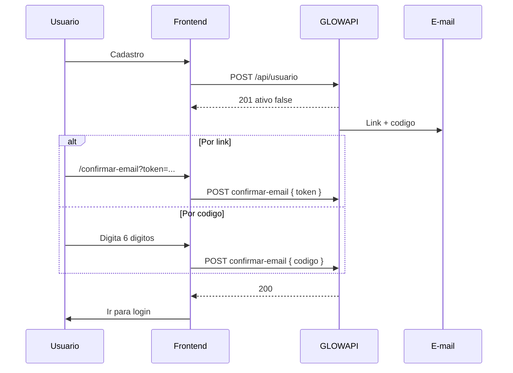

# Confirmacao de conta — frontend

Confirmacao de e-mail apos o cadastro.

**Anterior:** [cadastro.md](./cadastro.md) · **Proximo:** [login.md](./login.md)  
**Convencoes:** [convencoes.md](./convencoes.md) · **Indice:** [README.md](./README.md)

**Base URL local (padrao):** `http://localhost:5127`

---

## Visao geral

Apos `POST /api/usuario`, a conta fica com `ativo: false` ate confirmar o e-mail. Sem confirmacao, o login retorna **403** com codigo `EMAIL_NAO_CONFIRMADO`.

| Metodo | Origem | Endpoint |
|--------|--------|----------|
| **Link no e-mail** | Query `?token=` | `POST /api/auth/confirmar-email` com `{ "token" }` |
| **Codigo de 6 digitos** | Corpo do e-mail | `POST /api/auth/confirmar-email` com `{ "codigo" }` |



---

## Endpoints

Publicos (sem `x-glow-token`):

| Metodo | Rota | Descricao |
|--------|------|-----------|
| POST | `/api/auth/confirmar-email` | Ativa conta com token ou codigo |
| POST | `/api/auth/reenviar-confirmacao` | Novo token/codigo + e-mail |

---

## Configuracao (backend)

| Chave | Padrao | Efeito |
|-------|--------|--------|
| `Auth:FrontendBaseUrl` | `http://localhost:5173` | Base do link no e-mail |
| `Auth:ConfirmacaoEmailHoras` | `24` | Validade token/codigo |
| `Auth:ConfirmacaoCodigoDigitos` | `6` | Tamanho do codigo |

Link gerado:

```text
{FrontendBaseUrl}/confirmar-email?token=<token-opaco>
```

---

## 1. Confirmar por link (token)

### Fluxo no frontend

1. Usuario clica **Confirmar e-mail** no e-mail.
2. Abre `/confirmar-email?token=...`.
3. Extrai `token` da query string.
4. Chama API ao montar a pagina (loading).
5. Sucesso → CTA login; erro → reenvio ou codigo manual.

### Request

```http
POST {BASE_URL}/api/auth/confirmar-email
Content-Type: application/json
```

```json
{ "token": "valor-da-query-string" }
```

Envie **somente** `token` — nao envie `codigo` junto.

### Response (200)

```json
{
  "success": true,
  "message": "E-mail confirmado com sucesso. Voce ja pode fazer login."
}
```

### Exemplo (fetch)

```typescript
async function confirmarPorToken(token: string) {
  const res = await fetch(`${BASE_URL}/api/auth/confirmar-email`, {
    method: "POST",
    headers: { "Content-Type": "application/json" },
    body: JSON.stringify({ token }),
  });
  const data = await res.json();
  if (!res.ok) throw data;
  return data;
}

const token = new URLSearchParams(window.location.search).get("token");
if (token) await confirmarPorToken(token);
```

---

## 2. Confirmar por codigo

Tela pos-cadastro: input 6 digitos + botao **Confirmar**.

### Request

```json
{ "codigo": "482913" }
```

- Apenas digitos (padrao: 6).
- `Trim()` aplicado no backend.
- Nao envie `token` junto.

### UX sugerida

- Mascara `000000` ou 6 campos.
- Validar 6 digitos antes da API.
- Link **Reenviar codigo** e **Ja confirmou? Entrar**.

---

## 3. Reenviar confirmacao

Quando link/codigo expirou ou e-mail nao chegou.

### Request

```http
POST {BASE_URL}/api/auth/reenviar-confirmacao
```

```json
{ "email": "maria@email.com" }
```

### Response (200)

Sempre generica (nao revela se e-mail existe):

```json
{
  "success": true,
  "message": "Se o e-mail estiver cadastrado e pendente de confirmacao, enviaremos um novo link e codigo."
}
```

**Backend:** reenvio so se e-mail existe e `ativo: false`. Token/codigo anteriores sao invalidados.

**UX:** cooldown ~60 s no botao de reenvio; pre-preencher e-mail do cadastro.

---

## Erros

```json
{
  "success": false,
  "message": "Link ou codigo de confirmacao invalido ou expirado.",
  "code": "CONFIRMACAO_EMAIL_INVALIDA"
}
```

| HTTP | `code` | Quando | Acao UI |
|------|--------|--------|---------|
| 400 | `CONFIRMACAO_EMAIL_INVALIDA` | Token/codigo invalido ou expirado | Reenvio |
| 400 | `CONFIRMACAO_EMAIL_INVALIDA` | Token **e** codigo, ou nenhum | Corrigir payload |
| 403 | `EMAIL_NAO_CONFIRMADO` | Login antes de confirmar | Voltar para esta tela |

### Casos especiais

| Cenario | API | Frontend |
|---------|-----|----------|
| Ja confirmada | 200 idempotente | Redirecionar login |
| Token expirado (>24h) | 400 | Reenvio |
| Reenvio conta ativa | 200 (nada enviado) | Sugerir login |

---

## Conteudo do e-mail

Assunto: **Confirme seu cadastro**

- Botao → `{FrontendBaseUrl}/confirmar-email?token=...`
- Codigo 6 digitos em destaque
- Validade (ex.: 24 horas)
- Envio assincrono (pode demorar alguns segundos)

---

## Telas sugeridas

### `/confirmar-email`

| Estado | UI |
|--------|-----|
| Loading | Confirmando... |
| Sucesso | Conta confirmada + login |
| Erro | Reenvio ou codigo manual |
| Sem token | Formulario de codigo |

### `/aguardando-confirmacao`

- Texto com e-mail do usuario
- Input 6 digitos
- Reenviar e-mail
- Link para login

---

## TypeScript

```typescript
export interface ConfirmarEmailRequest {
  token?: string;
  codigo?: string;
}

export interface ReenviarConfirmacaoRequest {
  email: string;
}
```

---

## Servico completo

```typescript
export async function confirmarEmail(payload: ConfirmarEmailRequest) {
  const hasToken = Boolean(payload.token?.trim());
  const hasCodigo = Boolean(payload.codigo?.trim());
  if (hasToken === hasCodigo) {
    throw { code: "CONFIRMACAO_EMAIL_INVALIDA", message: "Informe exatamente token ou codigo." };
  }
  const res = await fetch(`${BASE_URL}/api/auth/confirmar-email`, {
    method: "POST",
    headers: { "Content-Type": "application/json" },
    body: JSON.stringify(
      hasToken ? { token: payload.token!.trim() } : { codigo: payload.codigo!.trim() }
    ),
  });
  const data = await res.json();
  if (!res.ok) throw data;
  return data;
}

export async function reenviarConfirmacao(email: string) {
  const res = await fetch(`${BASE_URL}/api/auth/reenviar-confirmacao`, {
    method: "POST",
    headers: { "Content-Type": "application/json" },
    body: JSON.stringify({ email: email.trim().toLowerCase() }),
  });
  const data = await res.json();
  if (!res.ok) throw data;
  return data;
}
```

---

## Testes (dev)

```bash
BASE=http://localhost:5127

# Por codigo
curl -s -X POST "$BASE/api/auth/confirmar-email" \
  -H "Content-Type: application/json" \
  -d '{"codigo": "482913"}'

# Por token
curl -s -X POST "$BASE/api/auth/confirmar-email" \
  -H "Content-Type: application/json" \
  -d "{\"token\": \"$TOKEN\"}"

# Reenviar
curl -s -X POST "$BASE/api/auth/reenviar-confirmacao" \
  -H "Content-Type: application/json" \
  -d '{"email": "maria@email.com"}'
```

SQL para obter codigo na fila — ver [../cadastro-usuario.md](../cadastro-usuario.md).

---

## Checklist

- [ ] Rota `/confirmar-email?token=` com confirmacao automatica
- [ ] Tela pos-cadastro com 6 digitos
- [ ] Reenvio com mensagem generica
- [ ] Tratar `CONFIRMACAO_EMAIL_INVALIDA`
- [ ] Tratar login `EMAIL_NAO_CONFIRMADO`

---

## Referencias no codigo

| Artefato | Caminho |
|----------|---------|
| Controller | `src/GLOWAPI.API/Controllers/AuthController.cs` |
| Service | `src/GLOWAPI.Application/Services/ConfirmacaoEmailService.cs` |
| Template e-mail | `src/GLOWAPI.Application/Mensageria/ConfirmacaoEmailTemplate.cs` |
