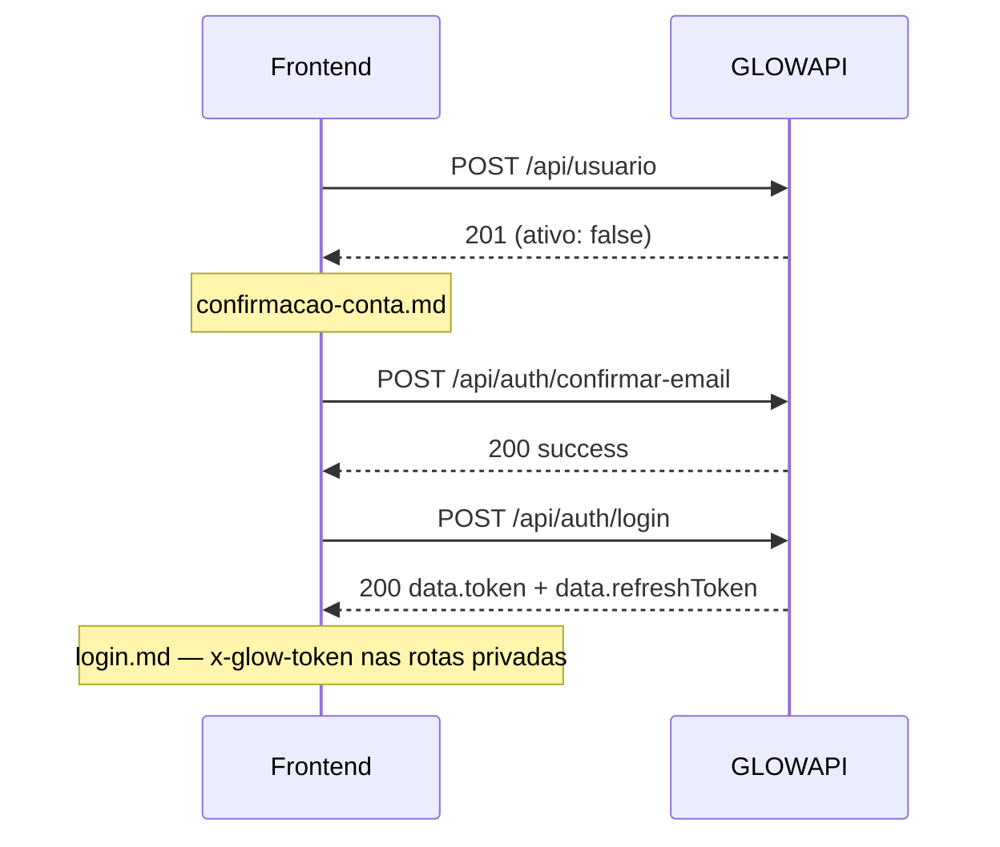

# Frontend — integracao GLOWAPI

Documentacao de integracao da GLOWAPI para o frontend, **separada por fluxo**.

**Base URL local (padrao):** `http://localhost:5127`  
**Swagger (dev/staging):** `{BASE_URL}/swagger`  
**Health check:** `GET {BASE_URL}/health`

Substitua `{BASE_URL}` pela URL da API (local, staging ou producao).

---

## Documentos

| Documento | Conteudo |
|-----------|----------|
| [../acesso/README.md](../acesso/README.md) | Controle de acesso: roles, planos e modulos por persona |
| [../acesso/specs/README.md](../acesso/specs/README.md) | **Assinatura e modulos** — vitrine, onboarding, guardas, faturas |
| [convencoes.md](./convencoes.md) | Content-Type, header `x-glow-token`, formatos de resposta e erros |
| [cadastro.md](./cadastro.md) | `POST /api/usuario` — criar conta cliente |
| [confirmacao-conta.md](./confirmacao-conta.md) | Confirmar e-mail (link, codigo, reenvio) |
| [login.md](./login.md) | Login, refresh, logout e perfil |
| [recuperacao-senha.md](./recuperacao-senha.md) | Esqueci a senha e redefinir senha |
| [descoberta-estabelecimentos.md](./descoberta-estabelecimentos.md) | Busca por proximidade (geolocation do cliente) |
| [endereco-assinante.md](./endereco-assinante.md) | Endereco completo do assinante (CEP + ViaCEP) |
| [area-cliente-agendamento.md](./area-cliente-agendamento.md) | Agendamento logado, listagem, cancelar e remarcar |
| [confirmacao-whatsapp.md](./confirmacao-whatsapp.md) | Confirmacao de numero e alertas WhatsApp |

**Testes manuais (backend/dev):** [../cadastro-usuario.md](../cadastro-usuario.md)

---

## Resumo de endpoints

| Fluxo | Metodo | Rota | Auth | Status |
|-------|--------|------|------|--------|
| Cadastro | POST | `/api/usuario` | Nao | Implementado |
| Confirmar e-mail | POST | `/api/auth/confirmar-email` | Nao | Implementado |
| Reenviar confirmacao | POST | `/api/auth/reenviar-confirmacao` | Nao | Implementado |
| Login | POST | `/api/auth/login` | Nao | Implementado |
| Refresh | POST | `/api/auth/refresh` | Nao | Implementado |
| Logout | POST | `/api/auth/logout` | Sim | Implementado |
| Esqueci a senha | POST | `/api/auth/forgot-password` | Nao | Implementado |
| Redefinir senha | POST | `/api/auth/reset-password` | Nao | Implementado |
| Estabelecimentos proximos | GET | `/api/publico/estabelecimentos/proximos` | Nao | Implementado |
| Detalhe da loja | GET | `/api/publico/estabelecimentos/{publicGuid}` | Nao | Implementado |
| Criar agendamento logado | POST | `/api/agendamentos` | Sim | Implementado |
| Meus agendamentos | GET | `/api/agendamentos/me` | Sim | Implementado |
| Detalhe agendamento | GET | `/api/agendamentos/me/{id}` | Sim | Implementado |
| Cancelar agendamento | POST | `/api/agendamentos/me/{id}/cancelar` | Sim | Implementado |
| Remarcar agendamento | POST | `/api/agendamentos/me/{id}/remarcar` | Sim | Implementado |
| Webhook WhatsApp Evolution | POST | `/api/webhooks/whatsapp/evolution` | Nao | Implementado |
| Confirmar WhatsApp | POST | `/api/auth/confirmar-whatsapp` | Nao | Fallback |
| Reenviar confirmacao WhatsApp | POST | `/api/auth/reenviar-confirmacao-whatsapp` | Nao | Implementado (body: `{ email }`) |
| Solicitar confirmacao WhatsApp | POST | `/api/usuario/me/whatsapp/solicitar-confirmacao` | Sim | Implementado |
| Opt-in WhatsApp | POST | `/api/usuario/me/whatsapp/opt-in` | Sim | Implementado |
| Confirmar WhatsApp estabelecimento | POST | `/api/estabelecimentos/{id}/whatsapp/confirmar` | Sim | Implementado |
| Solicitar confirmacao WhatsApp estab. | POST | `/api/estabelecimentos/{id}/whatsapp/solicitar-confirmacao` | Sim | Implementado |
| Opt-in WhatsApp estabelecimento | POST | `/api/estabelecimentos/{id}/whatsapp/opt-in` | Sim | Implementado |

---

## Fluxo completo

### Rotas de tela sugeridas

| Tela | Rota | Documento |
|------|------|-----------|
| Cadastro | `/cadastro` | [cadastro.md](./cadastro.md) |
| Aguardando confirmacao | `/aguardando-confirmacao` | [confirmacao-conta.md](./confirmacao-conta.md) |
| Confirmar e-mail (link) | `/confirmar-email?token=...` | [confirmacao-conta.md](./confirmacao-conta.md) |
| Login | `/login` | [login.md](./login.md) |
| Esqueci senha | `/auth/esqueci-senha` | [recuperacao-senha.md](./recuperacao-senha.md) |
| Redefinir senha | `/resetar-senha?token=...` | [recuperacao-senha.md](./recuperacao-senha.md) |
| Explorar lojas | `/explorar` | [descoberta-estabelecimentos.md](./descoberta-estabelecimentos.md) |
| Detalhe da loja | `/loja/{publicGuid}` | [area-cliente-agendamento.md](./area-cliente-agendamento.md) |
| Meus agendamentos | `/meus-agendamentos` | [area-cliente-agendamento.md](./area-cliente-agendamento.md) |
| Confirmar WhatsApp | `/confirmar-whatsapp` | [confirmacao-whatsapp.md](./confirmacao-whatsapp.md) |
| Escolher plano | `/onboarding/planos` | [../acesso/specs/catalogo-planos.md](../acesso/specs/catalogo-planos.md) |
| Checkout assinatura | `/onboarding/checkout` | [../acesso/specs/onboarding-assinatura.md](../acesso/specs/onboarding-assinatura.md) |
| Gestao assinatura | `/configuracoes/assinatura` | [../acesso/specs/modulos/assinatura.md](../acesso/specs/modulos/assinatura.md) |

---

## Checklist geral

- [ ] Cadastro → confirmacao → login (nao pular confirmacao)
- [ ] Interceptor HTTP com `x-glow-token`
- [ ] Refresh automatico antes de expirar o access token
- [ ] Tratar erros por `code` (ver [convencoes.md](./convencoes.md))
