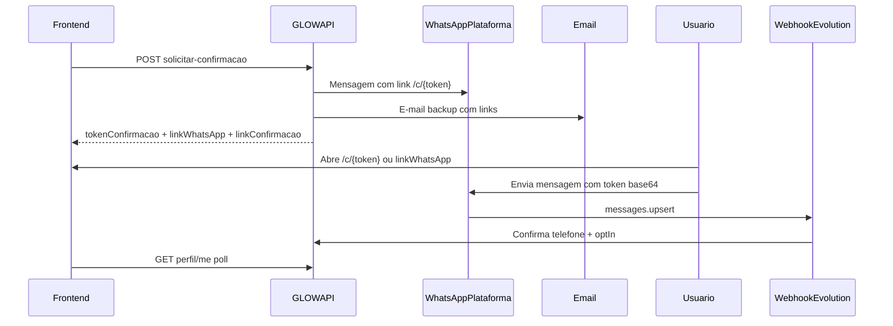

# Confirmacao WhatsApp

Fluxo **WhatsApp + e-mail backup** (estilo Bode): ao solicitar confirmacao, a API envia **WhatsApp** com link `/c/{token}` e **e-mail** de backup. O token e `base64(telefoneNormalizado)`. O usuario envia a mensagem; o webhook confirma e libera alertas.

**Regra geral:** alertas so sao enfileirados quando o telefone foi **confirmado** (`whatsAppConfirmado`) e o usuario/negocio aceitou alertas (`whatsAppOptIn`).

| Perfil | Telefone confirmado | Canal inicial |
|--------|---------------------|---------------|
| Cliente / profissional | `Usuario.Telefone` | WhatsApp + e-mail (`Usuario.Email`) |
| Estabelecimento | `Estabelecimento.Telefone` | WhatsApp + e-mail(s) deduplicados |

**Pre-requisito:** conta ativa (e-mail de cadastro confirmado) e telefone no perfil.

---

## Fluxo principal



1. Cadastre o telefone no perfil.
2. Chame `solicitar-confirmacao` — a API envia WhatsApp e e-mail.
3. Abra o link `/c/{token}` ou toque em **Confirmar no WhatsApp** (`wa.me` com token pre-preenchido).
4. Envie a mensagem **do numero cadastrado no perfil**.
5. O webhook confirma automaticamente (`whatsAppOptIn = true`).

---

## Cliente — solicitar confirmacao

`POST /api/usuario/me/whatsapp/solicitar-confirmacao`

**Headers:** `x-glow-token`

**200:**

```json
{
  "message": "Verifique o WhatsApp e seu e-mail para confirmar.",
  "data": {
    "numeroPlataforma": "5511999999999",
    "tokenConfirmacao": "NTUxMTk4ODg4Nzc3Nw==",
    "linkConfirmacao": "http://localhost:3000/c/NTUxMTk4ODg4Nzc3Nw==",
    "linkWhatsApp": "https://wa.me/5511999999999?text=NTUxMTk4ODg4Nzc3Nw%3D%3D",
    "whatsAppEnviado": true,
    "emailEnviado": true
  }
}
```

Dispara WhatsApp + e-mail automaticamente ao alterar `telefone` em `PUT /api/usuario/me`.

---

## Estabelecimento

| Acao | Rota |
|------|------|
| Obter perfil (status WhatsApp) | `GET /api/estabelecimentos/{id}/perfil` |
| Solicitar confirmacao | `POST /api/estabelecimentos/{id}/whatsapp/solicitar-confirmacao` |
| Opt-in | `POST /api/estabelecimentos/{id}/whatsapp/opt-in` |

`POST /api/estabelecimentos/{id}/whatsapp/confirmar` retorna **410** (codigo manual descontinuado).

---

## Pagina publica frontend

| Rota | Descricao |
|------|-----------|
| `/c/:token` | Pagina de confirmacao com botao wa.me |
| `/confirmar-whatsapp/:token` | Redirect legado para `/c/:token` |

---

## Webhook Evolution API

`POST /api/webhooks/whatsapp/evolution`

- Valida mensagem inbound contendo `base64(telefoneNormalizado)` do remetente
- Transicao: ainda aceita `GLOW {codigo}` para pendencias legadas

---

## Endpoints descontinuados

- `POST /api/auth/confirmar-whatsapp` → **410**
- `POST /api/estabelecimentos/{id}/whatsapp/confirmar` → **410**

---

## Configuracao

| Variavel | Uso |
|----------|-----|
| `Auth:FrontendBaseUrl` | Monta `linkConfirmacao` (`/c/{token}`) |
| `Mensageria:WhatsApp:NumeroPlataforma` | `linkWhatsApp` e mensagem outbound |
| `VITE_WHATSAPP_NUMBER` | Fallback na pagina publica `/c/:token` |

---

## Checklist frontend

- [x] Pagina `/c/:token`
- [x] Poll `GET /usuario/me` ou `GET /estabelecimentos/{id}/perfil`
- [x] Botao `linkWhatsApp` no perfil
- [x] Toggle opt-in apos confirmacao
- [x] Remover confirmacao manual por codigo
