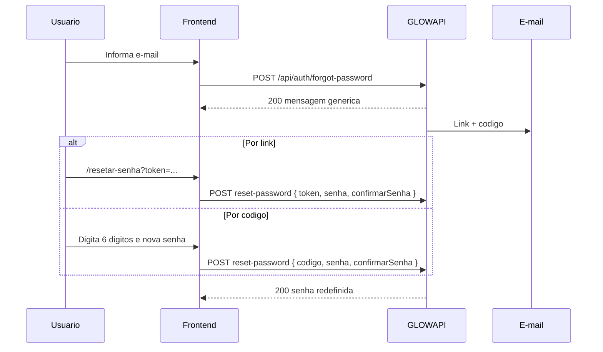

# Recuperacao de senha — frontend

Fluxo **esqueci a senha** e **redefinir senha**, no mesmo padrao da [confirmacao de conta](./confirmacao-conta.md).

**Convencoes:** [convencoes.md](./convencoes.md) · **Indice:** [README.md](./README.md)

---

## Visao geral

| Metodo | Origem | Endpoint |
|--------|--------|----------|
| **Solicitar** | Tela `/auth/esqueci-senha` | `POST /api/auth/forgot-password` com `{ "email" }` |
| **Link no e-mail** | Query `?token=` | `POST /api/auth/reset-password` com `{ "token", "senha", "confirmarSenha" }` |
| **Codigo de 6 digitos** | Corpo do e-mail | `POST /api/auth/reset-password` com `{ "codigo", "senha", "confirmarSenha" }` |

A resposta de `forgot-password` e **sempre 200 generico** (nao enumera se o e-mail existe). Reenvio reusa o mesmo endpoint.

Validade: **30 minutos** (`Auth:RecuperacaoSenhaMinutos`).



---

## Passo 1 — Solicitar e-mail

**Tela frontend:** `/auth/esqueci-senha`

```http
POST {BASE_URL}/api/auth/forgot-password
Content-Type: application/json
```

```json
{ "email": "maria@email.com" }
```

Resposta (200) — mensagem generica:

```json
{
  "success": true,
  "message": "Se o e-mail estiver cadastrado, enviaremos instrucoes para redefinir a senha."
}
```

Link no e-mail:

```text
{Auth:FrontendBaseUrl}/resetar-senha?token=<token-opaco>
```

O SPA registra alias `/resetar-senha` → `/auth/redefinir-senha` (preservando `?token=`).

---

## Passo 2 — Redefinir senha

Informe **exatamente** `token` **ou** `codigo`, mais a nova senha.

Regras de `senha`: mesmas do [cadastro.md](./cadastro.md). A nova senha deve ser diferente da atual.

```http
POST {BASE_URL}/api/auth/reset-password
Content-Type: application/json
```

Por link:

```json
{
  "token": "token-opaco-da-url",
  "senha": "NovaSenha123!",
  "confirmarSenha": "NovaSenha123!"
}
```

Por codigo:

```json
{
  "codigo": "482913",
  "senha": "NovaSenha123!",
  "confirmarSenha": "NovaSenha123!"
}
```

Resposta (200):

```json
{
  "success": true,
  "message": "Senha redefinida com sucesso. Voce ja pode fazer login."
}
```

Apos o reset, todas as sessoes do usuario sao revogadas.

---

## Erros

| HTTP | `code` | Quando |
|------|--------|--------|
| 400 | `RESET_SENHA_INVALIDO` | Token/codigo ausente, expirado, invalido, ou senha igual a atual |
| 400 | — (validation) | Senhas nao conferem ou complexidade invalida |

---

## Telas frontend

| Rota | Uso |
|------|-----|
| `/auth/esqueci-senha` | Informar e-mail |
| `/auth/esqueci-senha/codigo` | Digitar codigo de 6 digitos |
| `/auth/redefinir-senha` | Nova senha (`?token=` ou codigo da etapa anterior) |
| `/auth/redefinir-senha/sucesso` | Confirmacao |
| `/resetar-senha?token=` | Alias legado do link do e-mail |

---

## TypeScript

```typescript
export interface ForgotPasswordRequest {
  email: string
}

export interface ResetPasswordRequest {
  token?: string
  codigo?: string
  senha: string
  confirmarSenha: string
}
```

---

## Checklist

- [x] `POST /api/auth/forgot-password` com mensagem generica
- [x] E-mail com link + codigo de 6 digitos
- [x] `POST /api/auth/reset-password` com token XOR codigo
- [x] Alias `/resetar-senha?token=` no SPA
- [x] Sem `verify-reset-code` / `resend-reset-code`

---

## Referencias no codigo

| Artefato | Caminho |
|----------|---------|
| Service | `src/services/recoveryService.ts` |
| Composable | `src/composables/useForgotPassword.ts` |
| Telas | `src/views/auth/ForgotPasswordEmailView.vue`, `ForgotPasswordCodeView.vue`, `ResetPasswordView.vue` |
